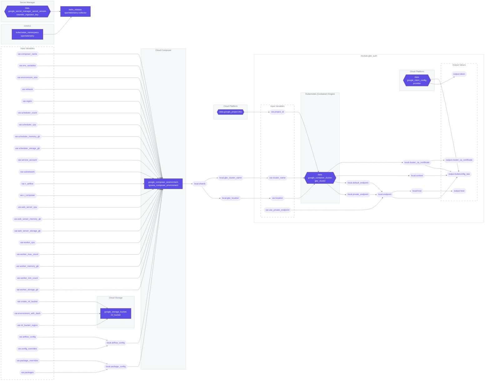

# Graph view
The output below is a render of Terraform graph to Mermaid's syntax. By rendering the output from Terraform graph into a
visual representation, it becomes easier to understand and analyze the complex relationships and dependencies between
infrastructure resources. This visualization enables engineers to gain a comprehensive view of their infrastructure and
identify potential bottlenecks, circular dependencies, or areas for optimization.

<!-- BEGIN_TF_DOCS -->
## Requirements

| Name | Version |
|------|---------|
|  [google-beta](#requirement\_google-beta) | ~> 4 |
|  [helm](#requirement\_helm) | ~> 2.10.0 |
|  [kubernetes](#requirement\_kubernetes) | ~> 2.21.0 |

## Providers

| Name | Version |
|------|---------|
|  [google](#provider\_google) | n/a |
|  [google-beta](#provider\_google-beta) | ~> 4 |
|  [helm](#provider\_helm) | ~> 2.10.0 |
|  [kubernetes](#provider\_kubernetes) | ~> 2.21.0 |

## Modules

| Name | Source | Version |
|------|--------|---------|
|  [gke\_auth](#module\_gke\_auth) | terraform-google-modules/kubernetes-engine/google//modules/auth | v26.1.1 |

## Resources

| Name | Type |
|------|------|
| [google-beta_google_composer_environment.iguana_composer_environment](https://registry.terraform.io/providers/hashicorp/google-beta/latest/docs/resources/google_composer_environment) | resource |
| [google_storage_bucket.ml_bucket](https://registry.terraform.io/providers/hashicorp/google/latest/docs/resources/storage_bucket) | resource |
| [helm_release.opentelemetry-collector](https://registry.terraform.io/providers/hashicorp/helm/latest/docs/resources/release) | resource |
| [kubernetes_namespace.opentelemetry](https://registry.terraform.io/providers/hashicorp/kubernetes/latest/docs/resources/namespace) | resource |
| [google_project.this](https://registry.terraform.io/providers/hashicorp/google/latest/docs/data-sources/project) | data source |
| [google_secret_manager_secret_version.newrelic_ingestion_key](https://registry.terraform.io/providers/hashicorp/google/latest/docs/data-sources/secret_manager_secret_version) | data source |

## Inputs

| Name | Description | Type | Default | Required |
|------|-------------|------|---------|:--------:|
|  [airflow\_config](#input\_airflow\_config) | Default Airflow configuration options. | `map(string)` | <pre>{   "celery-worker_concurrency": "40",   "core-dag_file_processor_timeout": "600",   "core-dagbag_import_timeout": "599",   "core-dags_are_paused_at_creation": "True",   "core-max_active_runs_per_dag": "1",   "core-max_active_tasks_per_dag": "250",   "core-parallelism": "500",   "database-load_default_connections": "False",   "scheduler-catchup_by_default": "False",   "scheduler-max_dagruns_per_loop_to_schedule": "20",   "scheduler-min_file_process_interval": "600",   "scheduler-parsing_processes": "32",   "scheduler-scheduler_health_check_threshold": "240",   "scheduler-scheduler_zombie_task_threshold": "3600",   "scheduler-task_queued_timeout": "1200",   "webserver-instance_name": "staging",   "webserver-rbac_user_registration_role": "User",   "webserver-show_trigger_form_if_no_params": "True",   "webserver-workers": "4" }</pre> | no |
|  [composer\_name](#input\_composer\_name) | The name to be given to the Composer environment itself. | `string` | `"iguana-stage"` | no |
|  [config\_overrides](#input\_config\_overrides) | Any configuration options to add alongside the defaults. | `map(string)` | `{}` | no |
|  [create\_ml\_bucket](#input\_create\_ml\_bucket) | If `true`, create an ml bucket for this environment. | `bool` | `false` | no |
|  [env\_variables](#input\_env\_variables) | A map of environment variables to be imported into the environment. | `map(string)` | `{}` | no |
|  [environment\_size](#input\_environment\_size) | The size of the environment as specified by Cloud Composer's options. | `string` | `"ENVIRONMENT_SIZE_LARGE"` | no |
|  [environment\_with\_dash](#input\_environment\_with\_dash) | The Airflow Variable `environment_with_dash` that will be used for this environment. | `string` | n/a | yes |
|  [ml\_bucket\_region](#input\_ml\_bucket\_region) | Region of the GCS bucket for this environment. | `string` | `"us"` | no |
|  [network](#input\_network) | Self-link of the VPC network where the GKE cluster will be created. Leave it null for Auto-mode VPCs | `string` | `null` | no |
|  [package\_overrides](#input\_package\_overrides) | A map of packages to override the default configuration with | `map(string)` | `{}` | no |
|  [packages](#input\_packages) | Base Python packages to be installed in the environment. | `map(string)` | <pre>{   "anticaptchaofficial": "==1.0.26",   "apache-airflow-providers-amazon": "==7.2.1",   "apache-airflow-providers-slack": "[http]==4.2.1",   "astronomer-providers": "==1.18.0",   "attrs": ">=19.2.0",   "base58": "",   "base58check": "",   "beautifulsoup4": "==4.7.1",   "bs4": "==0.0.1",   "cashaddress": "",   "coinaddrng": ">=1.1.1",   "crc32c": "==2.3.post0",   "elasticsearch": "==7.13.1",   "google-cloud-bigquery": "==3.4.0",   "graphframes": "==0.6",   "jsonlines": "",   "networkx": "",   "openpyxl": "==3.0.10",   "paramiko": "",   "pycryptodome": "==3.9.8",   "pydash": "",   "pyfarmhash": "",   "pypdf2": "==3.0.1",   "pyspark": "==3.2.2",   "pyswip": "==0.2.10",   "scikit-learn": "==1.3.0",   "scraperapi-sdk": "==0.2.2",   "scrapy": "==2.11.1",   "scrapy-zyte-api": "==0.8.1",   "slackclient": "==1.3.1",   "sshtunnel": "",   "telethon": "==1.26.1",   "twisted": "==22.4.0",   "unionfind": "",   "webhoseio": "==0.5",   "xlrd": "" }</pre> | no |
|  [region](#input\_region) | The region this environment should be deployed into. | `string` | `"us-central1"` | no |
|  [resilience\_mode](#input\_resilience\_mode) | Set the resilience mode of this environment. | `string` | `"STANDARD_RESILIENCE"` | no |
|  [scheduler\_count](#input\_scheduler\_count) | Number of schedulers to deploy. | `number` | `4` | no |
|  [scheduler\_cpu](#input\_scheduler\_cpu) | Number of scheduler CPUs. | `number` | `28` | no |
|  [scheduler\_memory\_gb](#input\_scheduler\_memory\_gb) | How much memory the scheduler should have in GB. | `number` | `28` | no |
|  [scheduler\_storage\_gb](#input\_scheduler\_storage\_gb) | How much disk the scheduler should have in GB. | `number` | `10` | no |
|  [service\_account](#input\_service\_account) | The service account to operate on behalf of the environment. | `string` | n/a | yes |
|  [subnetwork](#input\_subnetwork) | Self-link of the VPC subnetwork where the GKE cluster will be created. Leave it null for Auto-mode VPCs | `string` | `null` | no |
|  [triggerer\_count](#input\_triggerer\_count) | The number of triggerers for this environments. | `number` | `2` | no |
|  [triggerer\_cpu](#input\_triggerer\_cpu) | The number of CPUs per triggerer in this environment. | `number` | `1` | no |
|  [triggerer\_memory\_gb](#input\_triggerer\_memory\_gb) | The memory in GB per triggerer in this environment. | `number` | `1` | no |
|  [v\_airflow](#input\_v\_airflow) | Version of Airflow to be using. | `string` | `"2.7.3"` | no |
|  [v\_composer](#input\_v\_composer) | Version of Cloud Composer to be using. | `string` | `"2.6.5"` | no |
|  [web\_server\_cpu](#input\_web\_server\_cpu) | Number of CPUs for the web server. | `number` | `16` | no |
|  [web\_server\_memory\_gb](#input\_web\_server\_memory\_gb) | Amount of memory for the web server in GB. | `number` | `32` | no |
|  [web\_server\_storage\_gb](#input\_web\_server\_storage\_gb) | Amount of disk for the web server in GB. | `number` | `10` | no |
|  [worker\_cpu](#input\_worker\_cpu) | Number of worker CPUs. | `number` | `16` | no |
|  [worker\_max\_count](#input\_worker\_max\_count) | Max number of workers to scale up to. | `number` | `12` | no |
|  [worker\_memory\_gb](#input\_worker\_memory\_gb) | Amount of worker memory in GB. | `number` | `64` | no |
|  [worker\_min\_count](#input\_worker\_min\_count) | Minimum number of workers to scale down to. | `number` | `4` | no |
|  [worker\_storage\_gb](#input\_worker\_storage\_gb) | Amount of worker disk in GB. | `number` | `10` | no |

## Outputs

No outputs.
<!-- END_TF_DOCS -->
